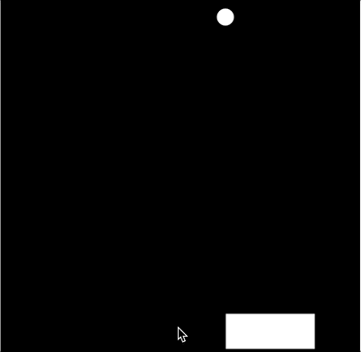

# Return Values and Collisons

While we have learned a lot about conditionals, there are many problems that we have solved that can be bundeld up as functions. Consider how we detected if our mouse was touching a circle, we could detect this by saying:

```javascript
ellipse(20, 20, 50)
var d = dist(20, 20, mouseX, mouseY)
if(d < 50/2){
	// Fill red when the mouse is over
	fill("red")
}
else{
	// Fill blue when the mouse is not over
	fill("blue")
}
```

We can bundle this up in a function that uses a return value. When a function finishes running, the program ***returns*** to the point in the code where the function was called. The `return` command tells the function to stop executing. Using the `return` command you can specify a single value to return to the code that called the original function. When function is done executing, it will be replaced with the return value.

We could take our previous code and make a `isMouseTouching()` function that checks any ellipse

```javascript
function isMouseTouching(x, y, radius)
	var d = dist(x, y, mouseX, mouseY)
	if(d < radius){
		return true
	}
	else {
		return false
	}
```

We could then use this to check if the mouse is touching and adjust the fill by doing:
```javascript
ellipse(20, 20, 50)
if(isMouseTouching(20, 20, 50)){
	// Fill red when the mouse is over
	fill("red")
}
else{
	// Fill blue when the mouse is not over
	fill("blue")
}
```

To write and create all of these would be **A LOT** of work. Luckily, there is a colision libary that has been imported here that allows you to check if many different types of p5 shapes are touching by using this [collison libary](https://github.com/bmoren/p5.collide2D) that has imported into today's code. There are built in commands we can use to check if objects are touching. Be sure to use the examples to help with today's code!

## Tasks for Today
1. Right an `isMouseTouchingCircle(x, y, radius)` function similar to the one described above. When the mouse is over the circle, the color should change.


2. Right an `isMouseTouchingRect(x, y, width, height)` function that changes the square a color if the mouse is over a square.


3. We are going to use the collision library to make a small p5 game! Start by calling the `arrows()` function that has already been written. If you have done this correctly, you will be able to move the paddle.



4. Get the ball to fall down the screen.

5. Using the `collideRectCircle()` function from the [collision libary](https://github.com/bmoren/p5.collide2D#colliderectcircle), get the ball to reappear at a new random position if the paddle and the ball collide.


6. Keep track of the score! Every time you catch a bubble, increase the score by 1 **AND** increase the speed at which the bubble falls.


7. Print a game over message if you miss the bubble and it goes off the screen.


**BONUS**: If the player loses the game, right a `reset()` function that resets the game so they can play again.